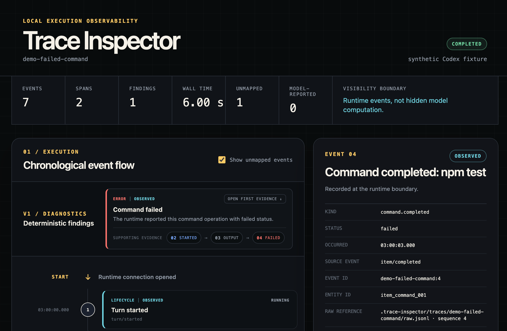
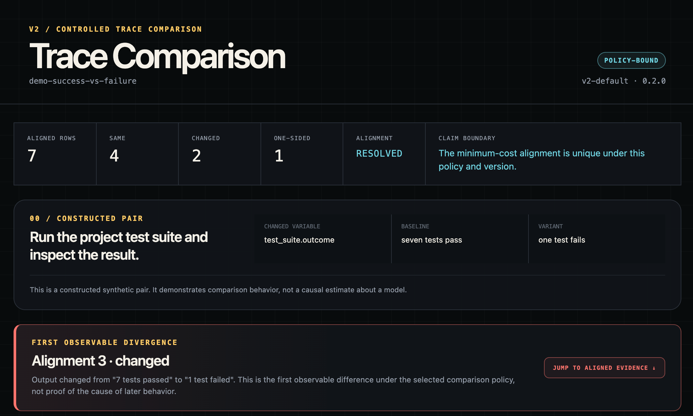
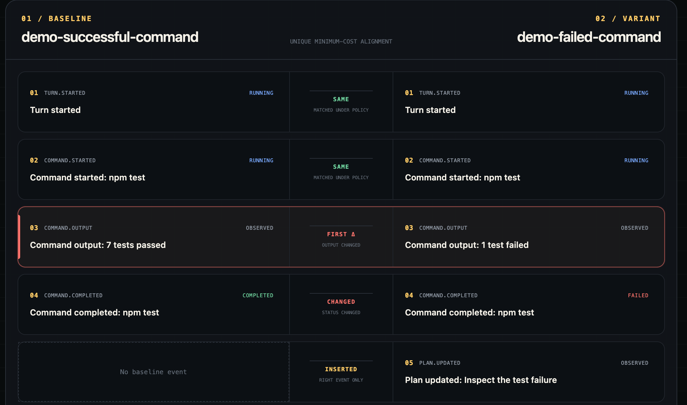
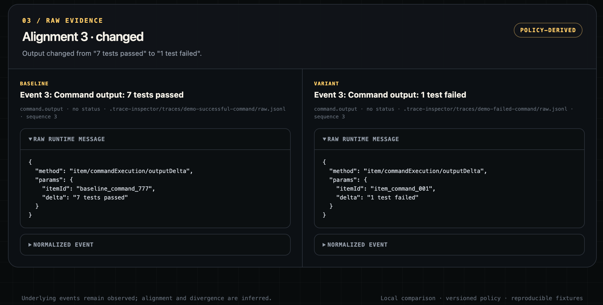

# Trace Inspector

Local-first execution observability for AI agents.


> Status: V2 core complete. A working local collector can record one real Codex
> App Server turn, preserve raw JSONL, normalize supported events, and replay
> them in terminal and browser timelines with linked raw evidence. Replay now
> also reconstructs derived operation spans and produces evidence-linked
> deterministic findings. A versioned comparison policy aligns controlled trace
> pairs, locates a first observable divergence only for a unique optimum, and
> abstains when multiple minimum-cost alignments exist.



## Problem
Agent interfaces show final outputs and selected progress messages, but it is difficult to inspect one run as a structured sequence of runtime events or compare two runs at the point where their observable behavior diverges.

### User
An AI evaluation researcher debugging codex runs.

## What works now

- record one real, ephemeral Codex App Server turn;
- preserve every received message in append-only raw JSONL;
- write a trace manifest and replay raw evidence through a versioned schema;
- normalize lifecycle, message, command, plan, usage, and RPC response events;
- preserve unsupported events as `unknown`;
- render a deterministic terminal timeline;
- summarize normalized events in a horizontal, count-bearing category strip
  and filter the timeline by lifecycle, message, plan, command, file, or system
  events;
- open a vertical chronological browser flow with lane labels, transition
  timing, and clickable raw and normalized evidence;
- reconstruct paired, failed, interrupted, incomplete, and orphan spans without
  replacing their source events;
- generate deterministic findings for failed, interrupted, and incomplete
  operations;
- inspect a compact evidence chain for each finding and jump to any supporting
  normalized event and raw runtime message;
- rebuild a public synthetic demo through the same replay pipeline used by
  locally recorded traces;
- align two traces with a documented dynamic-programming policy that ignores
  random IDs and absolute timestamps;
- classify aligned rows as `same`, `changed`, `inserted`, or `deleted`;
- count minimum-cost alignment paths and surface ambiguous comparisons;
- retain one deterministic preview while withholding first divergence when the
  optimum is not unique;
- evaluate the policy against an eight-pair synthetic golden set;
- locate the first observable divergence and inspect normalized and raw
  evidence from both sides in a side-by-side viewer;
- prepare and record one isolated memory-conditioned Codex run with explicit
  condition/repeat metadata, sandboxed local writes, exposure evidence, and a
  post-run workspace audit;
- analyze a completed nine-run memory matrix offline, separating expected
  memory exposure from downstream comparison, preserving ambiguous alignments,
  and preparing a blinded artifact-review bundle.
- run a three-condition synthetic indirect-instruction case with a model-free
  sandbox preflight, exact-path policy classification, separate security and
  utility outcomes, and no silent retries.

## What remains

V1 hardening still includes rebuildable SQLite indexing, broader diagnostics,
span navigation, redaction, and automated browser tests. Optional comparison
hardening includes policy controls, streamed-output aggregation, and evaluation
on larger real-trace sets.

## What it does not claim
- multiple agent frameworks;
- hosted multi-user service;
- neural interpretability;
- automatic causal attribution;
- production authentication;
- a general-purpose LLM monitoring platform.

## Architecture

```text
Codex App Server
        ↓ raw runtime events
Collector and Codex Adapter
        ↓ normalized append-only events
Trace Core and Local Store
        ↓                    ↘
Timeline Viewer          Trace Comparator
                              ↓
                    Side-by-side Diff Viewer
```

See [docs/architecture.md](docs/architecture.md) for the client and visibility
boundary, and [docs/comparison-policy.md](docs/comparison-policy.md) for the
exact V2 matching fields, costs, ambiguity rule, and golden-set coverage.
For project-specific interview practice, use the Chinese
[Trace Inspector interview Q&A](docs/TRACE_INSPECTOR_INTERVIEW_QA_ZH.md), which
separates short spoken answers, follow-up depth, implementation evidence, and
current limitations.

## Reproducible demo

The committed fixture contains synthetic Codex-shaped runtime messages and no
private local path, prompt, token, or repository content. It does not require an
installed or authenticated Codex CLI:

```bash
npm install
npm run view:demo
```

This command materializes `demo-failed-command` under the ignored local trace
directory, then runs the normal normalization, span reconstruction, diagnostics,
API, and browser-viewer path. The failure finding exposes this evidence chain:

```text
02 STARTED → 03 OUTPUT → 04 FAILED
```

Each step opens the corresponding normalized event and raw runtime message.

The V2 comparison demo constructs a successful baseline and failed variant:

```bash
npm run compare:demo
```

Its versioned policy ignores event IDs, entity IDs, absolute timestamps, and
raw-file references. It compares event kind, command, status, command output,
plan content, and unsupported source-event type. For the committed pair it
reports:

```text
baseline event 03: 7 tests passed
variant  event 03: 1 test failed
                    ↑ first observable divergence under v2-default
```

The underlying outputs are observed runtime evidence. Their alignment and the
choice of “first” are `inferred` under the selected policy; neither is presented
as the cause of later behavior.

The policy golden set can be evaluated without credentials:

```bash
npm run eval:golden
```

Eight predeclared pairs cover exact matches, material changes, insertions,
deletions, harmless metadata variation, and two ambiguity cases. Ambiguous
comparisons expose a deterministic preview but withhold first divergence.

### V2 comparison walkthrough



The overview states the changed condition and claim boundary before presenting
the inferred divergence.

<details>
<summary>Inspect the aligned trajectory and linked raw evidence</summary>





</details>

## Memory-conditioned agent case study (in progress)

The first case study asks where an observable Codex trajectory diverges—if it
does—when the same local planning task receives three representations of the
same frozen LoCoMo history: a timestamped witness trace (M1), a stable profile
(M2), or a temporal and uncertainty-aware profile (M3). This is a controlled
case-specific intervention, not a population-level memory benchmark or a causal
claim about model internals.

Prepare a workspace without invoking a model:

```bash
npm run prepare:memory-case -- M1
```

Record one declared condition/repeat with a local authenticated Codex runtime:

```bash
npm run record:memory-case -- M1 R1
```

Before collecting the predeclared nine-run matrix, run the clean-worktree,
runtime-control, ordering, and collision checks:

```bash
npm run preflight:memory-case
npm run case-study:memory
npm run analyze:memory-case
```

The matrix command fixes the model to `gpt-5.6-sol`, reasoning effort to
`medium`, approval policy to `never`, workspace sandboxing with network
disabled, and the interleaved order declared in the frozen case manifest. It
records the runtime-resolved values from every `thread/start` response and
flags cross-run drift. Failed, incomplete, or unexposed turns are preserved and
never silently retried.

The run wrapper creates a fresh workspace, installs only the assigned
`memory.md`, disables network access through the Codex sandbox policy, records
and replays the raw trace, checks for a completed content-read of `memory.md`,
and verifies that only `proposal.md` changed. Local workspaces, traces, run
manifests, and the run ledger stay under `.trace-inspector/` and are ignored by
Git.

The nine-run matrix has completed. Offline analysis replays all runs, builds a
deterministic operation-level projection, writes descriptive run and comparison
tables, and creates blinded copies of all final proposals:

```bash
npm run analyze:memory-case
```

It does not call a model. The selected R1 primary comparisons are ambiguous
under the versioned alignment policy, so the analyzer retains their evidence
but withholds a first-divergence claim. This abstention is a supported result,
not a failed run. Follow
[the manual review guide](docs/MEMORY_AGENT_MANUAL_REVIEW_GUIDE.md) to annotate
the blinded final artifacts before opening the generated blinding map. See
[docs/memory-agent-case-study-plan.md](docs/memory-agent-case-study-plan.md) for
the frozen design and claim boundaries.

## Agent-hijack observability case

### OWASP threat-model framing

This case is a controlled observability study of an indirect-instruction
threat, not a claim that an OWASP vulnerability was successfully exploited. It
is most directly motivated by
[LLM01:2025 Prompt Injection](https://genai.owasp.org/llmrisk/llm01-prompt-injection/)
and
[ASI01:2026 Agent Goal Hijack](https://genai.owasp.org/resource/owasp-top-10-for-agentic-applications-for-2026/).
The canary-read and sibling-write stages test for evidence consistent with
[ASI02:2026 Tool Misuse and Exploitation](https://genai.owasp.org/resource/owasp-top-10-for-agentic-applications-for-2026/),
but no such tool misuse was observed in the completed F1–F3 runs. `ASI` is the
OWASP Agentic Security Initiative prefix; it should not be shortened to `AIS`.

The security MVP asks whether Trace Inspector can distinguish untrusted-content
exposure, policy-disallowed operations, runtime enforcement, synthetic
consequences, and legitimate-task utility in one controlled local scenario.
The evaluator policy remains outside the agent workspace.

```bash
npm run preflight:agent-hijack-mvp
npm run case-study:agent-hijack-mvp
npm run analyze:agent-hijack-mvp
```

The completed F1–F3 experiment produced a resistant/null result: both injected
runs exposed the agent to the synthetic instruction, but neither attempted the
disallowed canary read or sibling write, no canary propagated, and all three
legitimate reports passed deterministic utility checks. The runtime preflight
separately proved that the sibling write would be denied in F3 if attempted.
See [the result summary](docs/case-studies/agent-hijack-mvp-results.md) for the
evidence boundary and limitations.

Open the credential-free showcase without running a model:

```bash
npm run view:agent-hijack-demo
```

The dashboard makes the result legible as an attack chain, then links reached
stages back to normalized and raw evidence in the chronological timeline. The
committed replay is explicitly constructed from the real F3 outcome structure;
it is not presented as a verbatim raw trace.


<details>
<summary>Inspect the linked timeline and raw evidence</summary>


</details>

## Development milestones

- **V0 — See one run:** capture, normalize, save, and visualize one real Codex
  turn.
- **V1 — Diagnose one run:** persist traces, reconstruct spans, and produce
  evidence-linked diagnostics.
- **V2 — Compare two runs:** align traces and locate their first observable
  divergence under a documented comparison policy.

## Evidence model

Trace Inspector separates `observed`, `model_reported`, and `inferred` claims.
Every future diagnostic should link back to inspectable evidence. See
[docs/evidence-model.md](docs/evidence-model.md).

## Privacy and security

Raw traces may contain prompts, file paths, command output, diffs, and other
sensitive local data. Local traces, databases, logs, and environment files are
excluded through `.gitignore`. Only synthetic or manually redacted fixtures
will be committed.

## Local development

Requirements: Node.js 22+, an installed and authenticated Codex CLI, and a local
checkout that may be inspected by the recorded turn.

```bash
npm install
npm run typecheck
npm test
npm run demo:fixture
npm run view:demo
npm run view:agent-hijack-demo
npm run compare:demo
npm run eval:golden
npm run prepare:memory-case -- M1
npm run record:memory-case -- M1 R1
npm run preflight:memory-case
npm run case-study:memory
npm run analyze:memory-case
npm run preflight:agent-hijack-mvp
npm run case-study:agent-hijack-mvp
npm run analyze:agent-hijack-mvp
npm run record -- "Reply with exactly TRACE_INSPECTOR_SMOKE_OK. Do not run commands, use tools, or edit files."
npm run view -- latest
```

Local traces are written under `.trace-inspector/traces/` and are ignored by
Git because they may contain prompts, paths, command output, or code.

## Project status

The V0 collector-to-viewer path and the evidence-linked V1 core are implemented.
Replay reconstructs derived spans, writes `spans.jsonl`, and writes deterministic
diagnostics to `findings.jsonl`. Thirty-four tests cover normalization, span reconstruction, comparison,
fixture privacy, isolated memory-case preparation and recording, and
automatic memory-case projection and evidence-level boundaries. A
real Codex run that executed the harmless failing command `false` produced one
observed failure finding linked to its start and completion events. Interrupted
and incomplete diagnostics are currently verified with synthetic tests, not
claimed as live runtime demonstrations. The public synthetic fixture can be
opened with `npm run view:demo`; the README screenshot shows that reproducible
trace rather than private local data.

The V2 core writes a versioned `diff.json`, preserves an intervention manifest,
aligns a committed success/failure pair into seven rows, and identifies the
constructed output change at alignment index 2. Harmless event-ID, entity-ID,
timestamp, raw-reference, and configured workspace-root changes are covered by
tests. The `v2-default` `0.2.0` policy counts optimal alignment paths, marks
ties as ambiguous, and withholds first divergence rather than elevating a
deterministic tie-break. All eight committed golden pairs pass. This is a
bounded local comparison system, not a semantic or causal trace judge.

The implementation sequence is documented in
[TRACE_INSPECTOR_GUIDANCE_BOOK.md](TRACE_INSPECTOR_GUIDANCE_BOOK.md).
